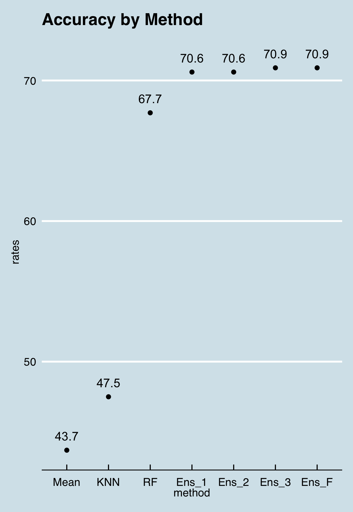

```{r setup, include=FALSE}
knitr::opts_chunk$set(echo = TRUE)
```

# Wine Rating Project
----

## Executive Summary
For my capstone choose your own project, I wanted to find something of personal interest and I stumbled across a wine data on UCI Machine Learning Archive. I’ve always been under the impression that there’s some je ne sais quoi about wine quality and I think it will be fascinating to some analysis on this dataset. We will see if we can predict the assigned quality rating on our validation set based on inputs from from our training set.

## Analysis and Methods

### Data Exploration
We have a dataframe of 4898 observations over 13 variables (I’ve combined the white and red datasets and added the color as an additional variable). These variables are all continuous, objective observations of various components of the wine, including density, acidity, sulfites, etc., except for the final observation, which is the subjective assignment of a quality ranking.

#### Input variables (based on physicochemical tests): 
1 - fixed acidity 
2 - volatile acidity 
3 - citric acid 
4 - residual sugar 
5 - chlorides 
6 - free sulfur dioxide 
7 - total sulfur dioxide 
8 - density 
9 - pH 
10 - sulphates 
11 - alcohol 
12 - color
#### Output variable (based on sensory data): 
13 - quality (score between 0 and 10)

When we initially plot our quality rankings we identify our first problem. Over 93% of wines are assigned a ranking of a 5, 6, or 7. In fact on the ten point scale, there are no 1s, 2s, or perfect 10s. While this will make predicting a score close to the actual score relatively easy, thinking as a sommelier, we don’t want to miss those wonderful 8’s and 9’s or risk giving someone a 3 or a 4.


Next we’ll visualize all of the different variables to see if we can identify any outliers that might lead us to what makes a top wine. As we can see, there isn't a ton to separate the top wines from the rest. The spread of each variable does get narrower but that could be explained by the smaller sample size. It also appears that each interquartile box overlaps with each other. 


A few variables do look promising: alcohol (higher values seem to lead to an improved quality), density (lower points to a higher quality. My experience as a home brewer tells me that alcohol levels have an effect on density), chloride, and volatile acids as well. 

### Analysis
We could start off just by predicting the most common quality assignment, a 6, for all of our wines. While this wouldn't be a very useful algorithm, it'll help us set a baseline accuracy. If we did this, we'd get an accuracy of 43.7%. I tried KNN to what a model can do and it returned an accuracy of 47.5% percent. Not much improvement over guessing and not a great start!

We want to throw a bunch of different models at this challenge to see which ones are effective but before we do, we need to trim down to the most useful factors. A smaller set of factors will allow us to try more models without taking hours. We run a Recursive Feature Elimination assessment to identify the top 5 factors by importance and get the result of alcohol, volatile.acidity, free.sulfur.dioxide, sulphates, chlorides. We already identified a couple of these in through our initial over-correlated.


For the record, I looked up volatile acids and they're what leads to the development of vinegar, definitely not a great thing for your wine to include at high levels.

Now that we have a smaller set of factors let's use some models on them to see how they perform. This does take some time to run. We see a couple models over 60% accuracy, a second group around 50%, and gamLoess just lost out in space. The top was Random Forest with an accuracy of 67.7%.


Our coursework has taught that combining multiple models should lead to an improvement in the accuracy. We'll combine our five models and see if we can improve on their individual performance. For this to be effective we want to compare correlation between models. If they're over-correlated (>.75), then we won't see improvement. We can see that we don't have any worries for this set.


I tried to use the caretEnsemble package to accomplish this but it threw me an error with multi-class problems. We'll have to build our ensemble in a similar manner to how we built the first one determining 2s against 7s with the MNIST dataset in the course. We will add back the additional factors that we trimmed earlier to bump up the accuracy if we can. We get an accuracy of 70.2% which is a rather small improvement. Because this improvement is so small, I'm going to go back and see if we can't adjust any of the tuning parameters on the individual models to get an improvement. The challenge is that the tree based models already take a bit of time to run.

I started with the worst model, the svmRadial, and ran a tuning grid on the model over various parameters to see which resulted in the greatest accuracy. We saw a significant jump from an initial 57% accuracy without tuning to a 65% with tuning. This puts it in the range of our top models. I then moved onto the GBM model, the second worst, to see if we could get similar results. This model has an additional tuning metric, greatly increasing the time in training. I also created a grid to tune that included almost 13 thousand combinations, which crashed r. One the second try, I reduced the tuning grid to 2200. After a second crash, I split the tuning grid in half. At the end of running it we saw an increase from 58.4. to 61%.

At this point we're ready to build our final ensemble of the three top performing models and the two improved models.

## Results
Using an ensemble of 5 different models, two of which we manually tuned, we ended up with a final accuracy of 70.9%. After I ran the final model, I went back and ran the intermediate steps against the test set to see how much we improved with each step. The first ensemble model with only 5 factors and no tuning is really where we peaked. The additional tuning and factors didn't actually improve the overall model, even if they improved their individual performance by a significant amount. 



## Conclusion
We were able to do some significant work on this dataset but ran into a wall relatively quickly. We were able to identify the top five drivers of quality: alcohol, volatile acidity, free sulfur dioxide, sulphates, and chlorides, and use them to make reasonable good predictions on quality. I did a quick google search on other data analyses doing similar classification of wines research but different datasets and found that they also identified similar driving factors and also topped out at around 70%. I wouldn't be shocked if certain factors that were purposefully omitted from this dataset, grape types, wine brand, wine selling price, region, vintage, etc., would have a greater impact on our ability to determine quality.

### Suggested Improvements
I think I made a bit of a mistake at the very beginning of this process when I treated quality as a categorical factor as opposed to a continuous one. While this was accurate, in this prediction algorithm it might have provided more value to the metaphorical wine grader to receive a suggestion that was not an exact quality assignment but a continuous output that would help validate their judgement. We may have ended up with the algorithm having significantly less misses by multiple factors. I also wish I had an academic license to compare my results to the initial research team and see how I could have improved.

I could have also potentially improved performance by creating a training, test, and validation set. This would have allowed for more tuning after testing the model and before a final validation.

### Final Thoughts
Overall, I am thrilled with the challenge of this project and course. I read Nate Silver's stats book "The Signal and the Noise" and thought, "man, I'd love to learn more about that." Starting from a place of no coding experience, never having taken a probability, calculus, or statistics course, and with the significant time crunch of completing these 9 modules in 6 months with a full-time job and a newborn, I am very happy with the progress that I've been able to make. Also, I come away with so much more respect for data scientists and developers. After spending hours just staring at incorrect code, I don't plan on complaining about bugs in other people's work anytime soon. While I'm not confident in my ability to do this as a line of work, I hope to use this knowledge to better understand and communicate with those that do. 

Thank you to Rafa, the staff, and my classmates for all of your help.
